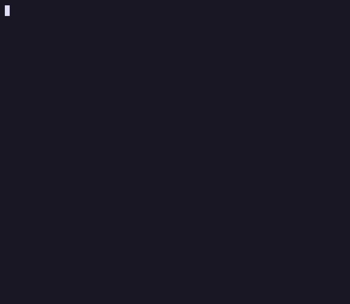
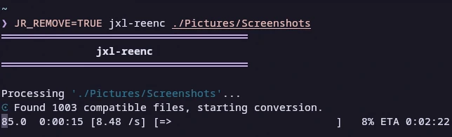

# jxl-reenc

> Let this simple, yet a little awkward script do all the job!

<!-- -->
## Showcase

Let’s see how this magic spell works first:



<!-- -->
## Installation / Update

### Prerequisites

You’d want `magick` with JpegXL support installed, `ffmpeg`, `libjxl`, and `coreutils`.

### Commands

```text
wget -O ~/.local/bin/jxl-reenc "https://raw.githubusercontent.com/rifux/jxl-reenc/main/jxl-reenc"
chmod +x ~/.local/bin/jxl-reenc
```

<!-- -->
## Usage

### TL;DR

You can specify files, dirs:

```text
jxl-reenc . ~/Pictures ~/Documents/Scans /run/media/user/SSD/16K.png
```

When launched without arguments it defaults to the current dir.

Use `JR_REMOVE=TRUE` to remove files after conversion and/or `JR_QUIET=TRUE` to silence the output:

```text
JR_REMOVE=TRUE jxl-reenc ~/Pictures   # removes original files if conversion succeeds
```



<br>

<!-- -->
### Full help page (yes, really!)

```text
❯ jxl-reenc --help
jxl-reenc version 0.2.1
Simple script for batch image-to-JpegXL conversion

Usage: [environment variables] jxl-reenc [locations such as dirs and files]
Examples:
  jxl-reenc
  jxl-reenc image.png
  jxl-reenc . ~/Pictures ~/Documents/Scans /run/media/user/SSD/16K.png

Environment variables:
  JR_REMOVE=TRUE
    Remove original files if conversion was successful (per-file).
  JR_QUIET=TRUE
    Silence the output.
Output explanation:
  ❯ JR_REMOVE=TRUE jxl-reenc ~/Pictures ~/Videos random_text
    
  Processing '/home/user/Pictures'...
  ⊙ Found 18 compatible files, start conversion.
  18.0  0:00:43 [ 409m/s] [=======================================>] 100%
    
  Processing '/home/user/Videos'...
  ⊙ Compatible files not found, SKIP.

  Processing 'random_text'...
  ⊘ Location not found, SKIP.
    
  ┌─────────────────────────────────────┐
  │               Results               │
  ├─────────────────────────────────────┤
  │  Compression rate            40.1%  │
  │  Original size              237MiB  │
  │  Final size                  95MiB  │
  │  Space saved                142MiB  │
  ├─────────────────────────────────────┤
  │  Images processed               18  │
  │  JXL files (skip)               98  │
  │  GIF files (skip)                0  │
  ├─────────────────────────────────────┤
  │  Conversions failed              0  │
  │  Locations skipped               2  │
  └─────────────────────────────────────┘

  Processing status:
    "⊙ Found %n compatible files, start conversion."
      Compatible files were detected, where %n is the number of them.
      A sign of success.
    
    "⊘ Location not found, SKIP."
      The specified path does not exist or is inaccessible.
    
    "⊙ Compatible files not found, SKIP."
      The location exists but contains no images to convert.

  Results table:
    "Compression rate"
      Size of converted files relatively to original.
      Good sign: <100%. Less is better. 
      Calculated as: (converted files size / original size) × 100%.
    
    "Original size / Final size / Space saved"
      Respectively, size of original compatible files, size of
      converted files, and space saved
      (calculated as original size - final size).

    "Images processed"
      Number of successfully converted images.
    
    "JXL files (skip) / GIF files (skip)"
      We skip already converted JXL files.
      GIF files won't be converted since they have
      quite mediocre compression rates.

    "Conversions failed"
      Number of files that weren't converted due to errors.
    
    "Locations skipped"
      Number of paths that weren't processed (invalid or empty).

Report issues if any!
  https://github.com/rifux/jxl-reenc/issues
```
